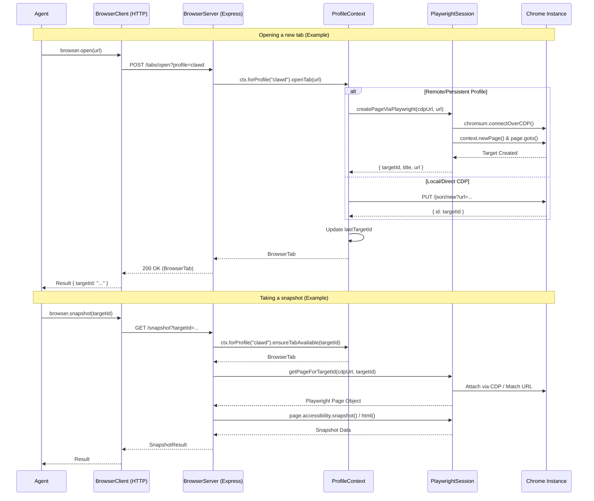

# Clawdbot Browser Architecture

This document outlines the architecture of the Clawdbot browser automation system, detailing how agent commands are translated into browser actions via a client-server model using Playwright and Chrome DevTools Protocol (CDP).

## Workflow Diagram

The following sequence diagram illustrates the end-to-end flow from an agent command to a browser action.

## Component Analysis

The architecture is split into four distinct layers, ensuring separation of concerns between the agent interface, the control plane, and the low-level automation.

### 1. Client Layer (`src/browser/client.ts`)
The **Client** provides a strongly-typed abstraction for agents to interact with the browser. It handles:
-   **HTTP Communication**: Sends requests to the Browser Server (e.g., `/start`, `/snapshot`, `/tabs`).
-   **Query Construction**: Serializes options like `profile`, `targetId`, and `format` into URL parameters.
-   **Type Safety**: Ensures responses match expected interfaces (`BrowserTab`, `SnapshotResult`).

### 2. Server Layer (`src/browser/server.ts`)
The **Server** is the control plane. It acts as an Express-based HTTP server that:
-   **Lifecycle Management**: Starts and stops the browser automation service.
-   **State Management**: Maintains a global `BrowserServerState` containing active profiles and configuration.
-   **Routing**: Delegates incoming HTTP requests to the appropriate handlers in `src/browser/routes/`.

### 3. Context & Profiles (`src/browser/server-context.ts`)
The **Context** layer manages the state and logic for individual browser profiles (e.g., "clawd" for automation, "extension" for user-driven sessions).
-   **Profile Isolation**: Each profile (Default, Chrome, Edge) has its own `ProfileContext`.
-   **Target Resolution**: Manages `lastTargetId` to provide continuity when an agent doesn't specify a target.
-   **Abstraction**: Hides the difference between local loopback CDP interactions (via raw HTTP) and remote/persistent connections (via Playwright).

### 4. Automation Layer (`src/browser/pw-session.ts`)
The **Automation** layer (Playwright Session) manages the direct connection to the browser instance.
-   **CDP Connection**: Uses `chromium.connectOverCDP` to maintain a persistent WebSocket connection to Chrome.
-   **Page Resolution**: The critical `getPageForTargetId` function maps a CDP `targetId` to a Playwright `Page` object, enabling the use of Playwright's rich API (locators, snapshots) on specific tabs.
-   **State Tracking**: Maintains `PageState` (console logs, network requests, errors) using WeakMaps attached to Playwright Page objects.
-   **Resilience**: Includes fallbacks for finding pages by URL when CDP attachment fails (common with extension-based relays).

## Key Concepts

### Target IDs
A `targetId` is the unique identifier for a specific browser tab or window (CDP Target).
-   **Origin**: Generated by Chrome/CDP.
-   **Usage**: Agents use this ID to direct actions (click, type, snapshot) to a specific page.
-   **Flow**: The Server returns a `targetId` upon tab creation or listing. The Agent must provide this ID for subsequent actions, or the system falls back to the `lastTargetId`.

### Profiles
Clawdbot supports multiple isolated browser profiles:
-   **clawd**: A fully automated, headless (or headed) Chrome instance managed by the bot.
-   **extension**: A relay mode that connects to a user's existing Chrome instance via the Clawdbot Browser Extension.
-   **custom**: User-defined profiles with specific CDP endpoints.

### Error Handling
Errors are propagated up the stack:
1.  **Playwright/CDP**: Low-level connection or timeout errors are caught in `pw-session.ts`.
2.  **Context**: Logic errors (e.g., "tab not found", "ambiguous target") are handled in `server-context.ts`.
3.  **Server**: Maps exceptions to HTTP status codes (404 for missing tabs, 409 for ambiguous requests).
4.  **Client**: Throws typed errors that the Agent can catch and handle (e.g., retrying a snapshot).
