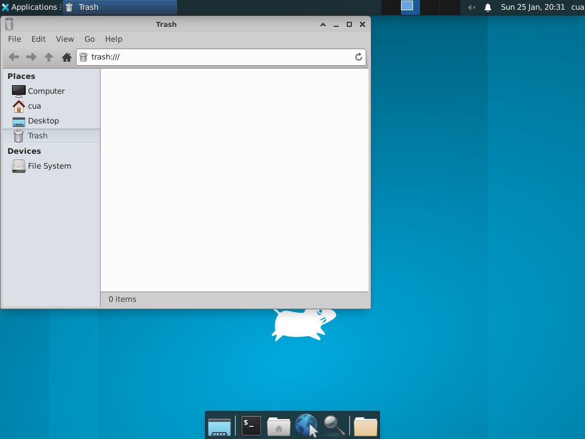

# Computer-Server Setup for GUI Automation

This guide explains how to set up [cua-computer-server](https://github.com/trycua/cua/tree/main/libs/python/computer-server) for desktop GUI automation with Clawdbot agents.

## Overview

The `computer` tool enables agents to:
- Take screenshots of the desktop
- Click at screen coordinates
- Type text and press keys
- Scroll and drag
- Control native applications

## Setup Options

### Option 1: Sandbox Mode (Recommended)

Use Cua's pre-built desktop sandbox images. Computer-server is already installed and running.



```yaml
# In your clawdbot config
agents:
  defaults:
    sandbox:
      docker:
        image: ghcr.io/trycua/cua-xfce:latest
```

Available sandbox images:

| Image | Description |
|-------|-------------|
| `ghcr.io/trycua/cua-xfce:latest` | Linux + XFCE desktop |
| `ghcr.io/trycua/cua-ubuntu:latest` | Linux + Kasm desktop |

For more options including Windows and Android, see [Cua Desktop Sandboxes](https://cua.ai/docs/cua/guide/get-started/what-is-desktop-sandbox#docker-sandboxes).

### Option 2: Node Mode (Linux)

For Linux nodes, you can set up computer-server to run as a daemon using supervisor.

#### 1. Install computer-server

```bash
pip install cua-computer-server
```

#### 2. Create startup script

Create `/usr/local/bin/start-computer-server.sh`:

```bash
#!/bin/bash
set -e

# Wait for X server to be ready
echo "Waiting for X server to start..."
while ! xdpyinfo -display :0 >/dev/null 2>&1; do
    sleep 1
done
echo "X server is ready"

# Start computer-server
export DISPLAY=:0
python3 -m computer_server --port 8000
```

Make it executable:

```bash
chmod +x /usr/local/bin/start-computer-server.sh
```

#### 3. Configure supervisor

Create `/etc/supervisor/conf.d/computer-server.conf`:

```ini
[program:computer-server]
command=/usr/local/bin/start-computer-server.sh
user=<your-user>
autorestart=true
stdout_logfile=/var/log/computer-server.log
stderr_logfile=/var/log/computer-server.error.log
```

#### 4. Start the service

```bash
sudo supervisorctl reread
sudo supervisorctl update
sudo supervisorctl start computer-server
```

### Option 3: Node Mode (Windows/macOS)

**TBD** - Setup instructions for Windows and macOS nodes will be added in a future update.

## Usage

Once computer-server is running, agents can use the `computer` tool:

```
Use the computer tool to take a screenshot and then click on the "File" menu.
```

The agent will:
1. Call `computer` with `action: "screenshot"` to see the screen
2. Identify the coordinates of "File" menu
3. Call `computer` with `action: "click"` and the coordinates

## Configuration

You can configure the computer-server URL in your Clawdbot config:

```yaml
tools:
  computer:
    serverUrl: "http://localhost:8000"
```

Or per-agent:

```yaml
agents:
  my-agent:
    tools:
      computer:
        serverUrl: "http://192.168.1.100:8000"
```

## MCP Alternative

Computer-server also exposes an MCP (Model Context Protocol) interface at `/mcp`. This could be used as an alternative integration method if Clawdbot adds MCP client support in the future.

To use computer-server as a standalone MCP server:

```bash
python -m computer_server --mcp
```

## Troubleshooting

### Connection refused

Ensure computer-server is running and accessible:

```bash
curl http://localhost:8000/status
```

Should return: `{"status": "ok", "os_type": "...", "features": [...]}`

### No display

If computer-server fails with display errors, ensure:
- X server is running (Linux)
- The `DISPLAY` environment variable is set correctly
- The user has permission to access the display

### Sandbox not connecting

Ensure the sandbox container has port 8000 exposed and the network is accessible from Clawdbot.

## Security Considerations

- **Sandbox mode**: Isolated container - safe for untrusted workloads
- **Node mode**: Controls the actual device screen - use only with trusted agents
- **Gateway mode**: Not supported - would give agents control of your actual desktop

## Related

- [cua-computer-server](https://github.com/trycua/cua/tree/main/libs/python/computer-server) - Desktop automation server
- [Cua Desktop Sandboxes](https://cua.ai/docs/cua/guide/get-started/what-is-desktop-sandbox) - Pre-built sandbox images
