# Deploy OpenClaw to Google Compute Engine

This script automates the deployment of OpenClaw to Google Compute Engine, following the official documentation at [`docs/platforms/gcp.md`](../../../../docs/platforms/gcp.md).

---

## For Beginners: What is all this?

### Architecture Overview

```mermaid
graph TB
    subgraph You["👤 YOU (user)"]
        Laptop["💻 Laptop<br/>(browser)"]
        Phone["📱 Phone<br/>(Telegram)"]
        Tablet["📱 Tablet<br/>(browser)"]
    end

    subgraph GCP["☁️ GOOGLE CLOUD PLATFORM"]
        subgraph VM["🖥️ VM (Compute Engine)<br/>Debian 12, 4GB RAM"]
            subgraph Docker["🐳 DOCKER"]
                Gateway["🤖 OPENCLAW GATEWAY<br/>(port 18789)<br/>─────────────<br/>• Receives Telegram messages<br/>• Processes with Claude AI<br/>• Responds automatically<br/>• Web UI for config"]
            end
            subgraph Volumes["📁 Mounted Volumes"]
                Config["~/.openclaw/<br/>(config, tokens)"]
                Workspace["~/openclaw/workspace/<br/>(agent workspace)"]
            end
        end
    end

    Laptop -->|"HTTPS<br/>(Tailscale)"| Gateway
    Phone -->|"Telegram API"| Gateway
    Tablet -->|"HTTPS<br/>(Tailscale)"| Gateway
    Gateway --> Config
    Gateway --> Workspace
```



### What does each technology do?

| Technology | What it is | Simple explanation |
|------------|-----------|---------------------|
| **Google Cloud Platform (GCP)** | Cloud computing | "Renting a computer in the cloud" - you pay ~$25/mo to have a server running 24/7 |
| **Compute Engine (VM)** | Virtual machine | A virtual computer inside GCP with Debian Linux, 4GB RAM, 20GB disk |
| **Docker** | Container runtime | "Isolated box for applications" - ensures OpenClaw works the same everywhere |
| **Tailscale** | Personal VPN | Connects your devices securely, provides free HTTPS, only you can access |
| **Gateway Token** | Authentication | "OpenClaw password" - even with the URL, you need the token to enter |
| **Anthropic API (Claude)** | AI service | "The bot's brain" - the AI that generates responses, pay per usage |

### Message flow in Telegram

```mermaid
sequenceDiagram
    participant You as 👤 You
    participant TG as 📱 Telegram
    participant GW as 🤖 OpenClaw Gateway
    participant AI as 🧠 Anthropic API

    You->>TG: 1. "Hello, Claude"
    TG->>GW: 2. Forward message
    GW->>AI: 3. Send to Claude
    AI->>GW: 4. Generate response
    GW->>TG: 5. Send reply
    TG->>You: 6. "Hello! How can I help?"
```



### Why use Tailscale?

```mermaid
graph LR
    subgraph Without["❌ WITHOUT TAILSCALE"]
        B1["🌐 Browser"] -->|"HTTP"| IP1["http://35.192.x.x:18789"]
        IP1 -->|"❌ BLOCKED"| Error["Insecure connection<br/>WebSocket requires HTTPS"]
    end
```

```mermaid
graph LR
    subgraph With["✅ WITH TAILSCALE"]
        B2["🌐 Browser"] -->|"HTTPS"| TS["🔐 Tailscale<br/>Private VPN"]
        TS -->|"Encrypted"| VM2["🖥️ VM on GCP"]
        VM2 --> OK["✅ Works!<br/>Auto SSL + Private access"]
    end
```





### Access Modes Compared

| Mode | Security | Convenience | How it works |
|------|----------|-------------|--------------|
| **SSH Tunnel** (default) | ⭐⭐⭐⭐⭐ | ⭐⭐ | Run SSH command every time, access via `localhost:18789` |
| **Tailscale** (recommended) | ⭐⭐⭐⭐⭐ | ⭐⭐⭐⭐⭐ | Install once, automatic HTTPS, only your devices can access |
| **Public IP** (not recommended) | ⭐⭐ | ⭐⭐⭐⭐ | Anyone can try to access, UI doesn't work (needs HTTPS) |

### What the script does automatically

```mermaid
flowchart TD
    Start["🚀 run.sh --project X --tailscale --telegram-user-id Y"] --> Step1

    subgraph Step1["Step 1: Verification"]
        V1["✓ gcloud CLI installed?"]
        V2["✓ Authenticated on GCP?"]
        V3["✓ Project has billing?"]
    end

    Step1 --> Step2

    subgraph Step2["Step 2: Create VM"]
        VM1["Create e2-medium (4GB RAM)"]
        VM2["Install Docker"]
        VM3["Configure firewall"]
    end

    Step2 --> Step3

    subgraph Step3["Step 3: Configure OpenClaw"]
        C1["Clone repository"]
        C2["Create .env with keys"]
        C3["Auto-generate tokens"]
    end

    Step3 --> Step4

    subgraph Step4["Step 4: Build & Start"]
        B1["docker compose build"]
        B2["docker compose up -d"]
        B3["Verify stability (3 checks)"]
    end

    Step4 --> Step5

    subgraph Step5["Step 5: Tailscale (if --tailscale)"]
        T1["Install Tailscale on VM host"]
        T2["Authenticate (link in terminal)"]
        T3["Run 'tailscale serve' on host"]
        T4["Automatic HTTPS → localhost:18789"]
    end

    Step5 --> Step6

    subgraph Step6["Step 6: Telegram (if --telegram-user-id)"]
        TG1["Set dmPolicy = allowlist"]
        TG2["Add your user ID to allowlist"]
    end

    Step6 --> Result["✅ DONE!<br/>URL: https://openclaw-gateway.tailnet-xxx.ts.net<br/>Telegram: Message @YourBot!"]
```



### Estimated Costs

| Service | Cost | Notes |
|---------|------|-------|
| **GCP VM** (e2-medium) | ~$25/mo | 4GB RAM, runs 24/7 |
| **GCP Disk** (20GB) | ~$2/mo | Persistent storage |
| **GCP Network** | ~$1-5/mo | Depends on usage |
| **Anthropic API** | ~$5-20/mo | Claude 3.5 Sonnet: $3/1M input, $15/1M output |
| **Tailscale** | FREE | Up to 100 devices |
| **Telegram** | FREE | |
| **TOTAL** | **~$33-52/mo** | |

---

## What the Script Does (follows docs/platforms/gcp.md)

The script automates the deployment steps from the official documentation:

1. **Checks prerequisites** - gcloud CLI, authentication, billing
2. **Enables APIs** - Compute Engine API
3. **Creates VM** - e2-medium, Debian 12, 20GB (configurable)
4. **Installs Docker** - Via startup script
5. **Clones repository** - `git clone` on the VM
6. **Creates persistent directories** - `~/.openclaw` and `~/openclaw/workspace`
7. **Configures .env** - All required variables including `GOG_KEYRING_PASSWORD`
8. **Creates docker-compose.yml** - With volume mounts for persistence
9. **Creates Dockerfile.gcp** - Optimized for GCP deployment
10. **Builds and launches** - `docker compose build && docker compose up -d`
11. **Verifies gateway** - Shows startup logs

## Prerequisites

- [Google Cloud CLI](https://cloud.google.com/sdk/docs/install) installed and authenticated
- A Google Cloud project with billing enabled
- An Anthropic API key ([get one here](https://console.anthropic.com/))

## Quick Start

```bash
# Recommended: Full setup with Tailscale HTTPS + Telegram auto-approval
./scripts/deploy/google/compute-engine/run.sh \
  --project YOUR_PROJECT_ID \
  --anthropic-key sk-ant-xxx \
  --tailscale \
  --telegram-user-id YOUR_TELEGRAM_USER_ID

# Production deployment (e2-medium, SSH tunnel access - most secure)
./scripts/deploy/google/compute-engine/run.sh \
  --project YOUR_PROJECT_ID \
  --anthropic-key sk-ant-xxx

# Restrict access to your IP only (recommended - auto-detects and confirms)
./scripts/deploy/google/compute-engine/run.sh \
  --project YOUR_PROJECT_ID \
  --anthropic-key sk-ant-xxx \
  --my-ip

# Free tier deployment (e2-micro, may OOM under load)
./scripts/deploy/google/compute-engine/run.sh \
  --project YOUR_PROJECT_ID \
  --machine-type e2-micro \
  --anthropic-key sk-ant-xxx

# With .env file
./scripts/deploy/google/compute-engine/run.sh \
  --project YOUR_PROJECT_ID \
  --env-file .env

# With HTTPS via Tailscale (recommended for direct browser access)
./scripts/deploy/google/compute-engine/run.sh \
  --project YOUR_PROJECT_ID \
  --anthropic-key sk-ant-xxx \
  --tailscale
```

To find your Telegram user ID, message [@userinfobot](https://t.me/userinfobot) on Telegram.

To find your IP address:

```bash
curl -4 ifconfig.me
```

## Options

| Option | Default | Description |
|--------|---------|-------------|
| `--project PROJECT_ID` | (required) | Google Cloud project ID |
| `--zone ZONE` | `us-central1-a` | Compute Engine zone |
| `--instance NAME` | `openclaw-gateway` | Instance name |
| `--machine-type TYPE` | `e2-medium` | Machine type (4GB RAM, needed for builds) |
| `--disk-size SIZE` | `20GB` | Boot disk size |
| `--env-file FILE` | - | Load environment variables from file |
| `--anthropic-key KEY` | - | Anthropic API key |
| `--gateway-token TOKEN` | auto-generated | Gateway authentication token |
| `--my-ip` | - | Auto-detect your IP and restrict firewall (API only, UI needs HTTPS) |
| `--allowed-ip IP` | - | Restrict firewall to specific IP (API only, UI needs HTTPS) |
| `--tailscale` | - | Install Tailscale for HTTPS access (recommended for UI) |
| `--telegram-user-id ID` | - | Telegram user ID to auto-approve (no pairing needed) |

## Access Modes

### SSH Tunnel (default, most secure)

By default, the gateway binds to loopback only (`127.0.0.1:18789`). Access via SSH tunnel:

```bash
# Create tunnel from your laptop
gcloud compute ssh openclaw-gateway --zone=us-central1-a --project=YOUR_PROJECT -- -L 18789:127.0.0.1:18789

# Open in browser
http://127.0.0.1:18789/
```

**Pros:** Most secure, no ports exposed to internet
**Cons:** Requires SSH tunnel every time you access the UI

### Tailscale (recommended for direct browser access)

With `--tailscale` flag, the script:
1. Installs Tailscale on the VM host (before Docker build)
2. Authenticates Tailscale (you click the link in terminal)
3. Runs `sudo tailscale serve --bg --yes 18789` on the host
4. Docker container binds to `0.0.0.0:18789` for Tailscale to proxy

```bash
./scripts/deploy/google/compute-engine/run.sh \
  --project YOUR_PROJECT \
  --anthropic-key sk-ant-xxx \
  --tailscale

# Follow the authentication link that appears in the terminal
# Then access via: https://openclaw-gateway.your-tailnet.ts.net/
```

After deployment, you can access the Gateway UI directly via the Tailscale URL - no port number needed (Tailscale Serve handles HTTPS on port 443).

**Pros:** HTTPS works, direct browser access, secure, no SSH tunnel needed
**Cons:** Requires Tailscale account (free)

### IP Restricted Access (API only - UI requires HTTPS)

With `--my-ip` flag, the script auto-detects your IP and asks for confirmation.

**Note:** Due to browser security (secure context), the UI only works via localhost or HTTPS. Use SSH tunnel or Tailscale for UI access.

```bash
# Deploy with auto-detected IP restriction (recommended)
./scripts/deploy/google/compute-engine/run.sh \
  --project YOUR_PROJECT \
  --anthropic-key sk-ant-xxx \
  --my-ip

# The script will:
# 1. Detect your IP (e.g., 186.220.38.207)
# 2. Ask: "Restrict access to IP 186.220.38.207? [Y/n]"
# 3. If yes, proceed with deployment restricted to your IP

# Or specify IP manually:
./scripts/deploy/google/compute-engine/run.sh \
  --project YOUR_PROJECT \
  --anthropic-key sk-ant-xxx \
  --allowed-ip 186.220.38.207

# Access directly (no tunnel needed)
http://INSTANCE_IP:18789/?token=YOUR_GATEWAY_TOKEN
```

**Pros:** Direct access to UI without SSH tunnel, secure (only your IP can connect)
**Cons:** If your IP changes, you need to update the firewall rule:

```bash
# Update allowed IP
gcloud compute firewall-rules update openclaw-gateway \
  --project=YOUR_PROJECT \
  --source-ranges="NEW_IP/32"
```

### Public Access (not recommended)

With `--public` flag, the gateway is exposed to all IPs:

```bash
# Deploy with public access (open to everyone)
./scripts/deploy/google/compute-engine/run.sh --project YOUR_PROJECT --anthropic-key sk-ant-xxx --public

# Access directly
http://INSTANCE_IP:18789/?token=YOUR_GATEWAY_TOKEN
```

**Warning:** Anyone with the token can access your gateway. Only use this if you understand the security implications.

### How to Find Your IP Address

```bash
# Use curl
curl -4 ifconfig.me
```

This will return something like `186.220.38.207`.

**Tip:** Use `--my-ip` flag during deployment to auto-detect and confirm your IP automatically.

### Managing Allowed IPs

#### Add or change your IP

If your IP changes, update the firewall rule:

```bash
# Update to new single IP
gcloud compute firewall-rules update openclaw-gateway \
  --project=YOUR_PROJECT \
  --source-ranges="NEW_IP/32"
```

#### Allow multiple IPs

To allow multiple IPs (e.g., home and office):

```bash
# Allow multiple IPs (comma-separated)
gcloud compute firewall-rules update openclaw-gateway \
  --project=YOUR_PROJECT \
  --source-ranges="186.220.38.207/32,200.100.50.25/32"
```

#### Allow an IP range

To allow a range of IPs:

```bash
# Allow a /24 subnet (e.g., 186.220.38.0 - 186.220.38.255)
gcloud compute firewall-rules update openclaw-gateway \
  --project=YOUR_PROJECT \
  --source-ranges="186.220.38.0/24"
```

#### Check current allowed IPs

```bash
gcloud compute firewall-rules describe openclaw-gateway \
  --project=YOUR_PROJECT \
  --format="value(sourceRanges)"
```

## What Persists Where

| Component | Location | Persistence | Notes |
|-----------|----------|-------------|-------|
| Gateway config | `~/.openclaw/` | Host volume | `openclaw.json`, tokens |
| OAuth tokens | `~/.openclaw/` | Host volume | Model auth profiles |
| WhatsApp session | `~/.openclaw/` | Host volume | Preserves QR login |
| Gmail keyring | `~/.openclaw/` | Host volume | Requires `GOG_KEYRING_PASSWORD` |
| Agent workspace | `~/openclaw/workspace/` | Host volume | Code and artifacts |
| Application | Docker image | Rebuilt on update | Node.js app and dependencies |

## Machine Types

| Type | vCPU | Memory | Monthly Cost | Notes |
|------|------|--------|--------------|-------|
| e2-micro | 0.25 | 1 GB | Free tier | ❌ OOM during build and runtime |
| e2-small | 0.5 | 2 GB | ~$12/mo | ❌ OOM during Docker build |
| e2-medium | 1 | 4 GB | ~$25/mo | ✅ **Default** - works for build and runtime |

### Why e2-medium?

The Docker build process (`pnpm install`) requires ~3GB of RAM. Smaller machines will be killed by the OS (OOM - Out of Memory) during the build phase.

- **e2-micro (1GB)**: Will OOM during build and often during runtime
- **e2-small (2GB)**: Will OOM during Docker build (`pnpm install`)
- **e2-medium (4GB)**: Works for build and runtime ✅

After the initial build, runtime memory usage is lower (~1-2GB). If cost is a concern, you can:
1. Build with `e2-medium`
2. After successful deployment, downgrade to `e2-small` for runtime

## Post-Deployment Commands

### SSH to instance

```bash
gcloud compute ssh openclaw-gateway --zone=us-central1-a --project=YOUR_PROJECT
```

### View logs

```bash
gcloud compute ssh openclaw-gateway --zone=us-central1-a --project=YOUR_PROJECT \
  --command='cd ~/openclaw && docker compose logs -f'
```

### Restart gateway

```bash
gcloud compute ssh openclaw-gateway --zone=us-central1-a --project=YOUR_PROJECT \
  --command='cd ~/openclaw && docker compose restart'
```

### Update OpenClaw

```bash
gcloud compute ssh openclaw-gateway --zone=us-central1-a --project=YOUR_PROJECT \
  --command='cd ~/openclaw && git pull && docker compose build && docker compose up -d'
```

## Telegram Auto-Approval

By default, OpenClaw requires users to "pair" before using the bot via Telegram. With `--telegram-user-id`, you can pre-approve your Telegram account:

```bash
./scripts/deploy/google/compute-engine/run.sh \
  --project YOUR_PROJECT \
  --anthropic-key sk-ant-xxx \
  --telegram-user-id 123456789
```

This sets:
- `channels.telegram.dmPolicy: "allowlist"` - Only allowlisted users can message the bot
- `channels.telegram.allowFrom: ["123456789"]` - Your user ID is pre-approved

**How to find your Telegram user ID:**
1. Message [@userinfobot](https://t.me/userinfobot) on Telegram
2. It will reply with your user ID (a number like `123456789`)

## Uninstall

```bash
# Delete instance and firewall rule
./scripts/deploy/google/compute-engine/uninstall.sh --project YOUR_PROJECT

# Keep firewall for future deployments
./scripts/deploy/google/compute-engine/uninstall.sh --project YOUR_PROJECT --keep-firewall
```

## Troubleshooting

### SSH connection refused

SSH key propagation can take 1-2 minutes after VM creation. Wait and retry.

### Instance not starting

Check the serial console output:

```bash
gcloud compute instances get-serial-port-output openclaw-gateway \
  --zone=us-central1-a --project=YOUR_PROJECT
```

### Out of memory (OOM)

If you see `exit code: 137` or `Killed` during Docker build, the VM ran out of memory.

**Solution:** Upgrade to `e2-medium` (4GB RAM):

```bash
# Stop the VM
gcloud compute instances stop openclaw-gateway --zone=us-central1-a --project=YOUR_PROJECT

# Change machine type to e2-medium (4GB RAM)
gcloud compute instances set-machine-type openclaw-gateway \
  --zone=us-central1-a --project=YOUR_PROJECT \
  --machine-type=e2-medium

# Start the VM
gcloud compute instances start openclaw-gateway --zone=us-central1-a --project=YOUR_PROJECT

# Re-run the build
gcloud compute ssh openclaw-gateway --zone=us-central1-a --project=YOUR_PROJECT \
  --command='cd ~/openclaw && docker compose build && docker compose up -d'
```

**Note:** The default is now `e2-medium` to avoid this issue. See [Machine Types](#machine-types) for details.

### Docker build fails

SSH into the instance and check disk space:

```bash
gcloud compute ssh openclaw-gateway --zone=us-central1-a --project=YOUR_PROJECT
df -h
docker system prune -a  # Clean up old images
```

## Security Recommendations

1. **Use `--tailscale`** (recommended) - Automatic HTTPS, private access via your tailnet
2. **Use SSH tunnel** - Most secure, but requires tunnel for each access
3. **Use `--allowed-ip`** - Restricts to your IP only (API only, UI needs HTTPS)
4. **Avoid `--public`** - Open to all IPs, only use if you understand the risks
5. **Rotate tokens** - Change `OPENCLAW_GATEWAY_TOKEN` periodically
6. **Use `--telegram-user-id`** - Pre-approve only your Telegram account (no open pairing)

## Tailscale HTTPS Details

When using `--tailscale`, the script sets up automatic HTTPS via Tailscale Serve:

1. **VM Host**: Tailscale daemon runs on the VM, authenticated to your tailnet
2. **Tailscale Serve**: The script runs `sudo tailscale serve --bg --yes 18789` on the HOST
3. **Docker Container**: Binds to `0.0.0.0:18789` so Tailscale can proxy to it

The architecture is:
```
Internet → Tailscale (HTTPS:443) → localhost:18789 → Docker (gateway)
```

Tailscale Serve runs on the HOST (not in the container) because it requires root permissions.

### Manual Tailscale Setup (if not using `--tailscale`)

If you deployed without `--tailscale` and want to add it later:

```bash
# SSH to instance
gcloud compute ssh openclaw-gateway --zone=us-central1-a --project=YOUR_PROJECT

# Install Tailscale on the VM host
curl -fsSL https://tailscale.com/install.sh | sh
sudo tailscale up --hostname=openclaw-gateway

# Configure Tailscale Serve to proxy HTTPS to the gateway port
sudo tailscale serve --bg --yes 18789

# Verify it's working
tailscale serve status
```

This gives you a secure URL like `https://openclaw-gateway.your-tailnet.ts.net`.
